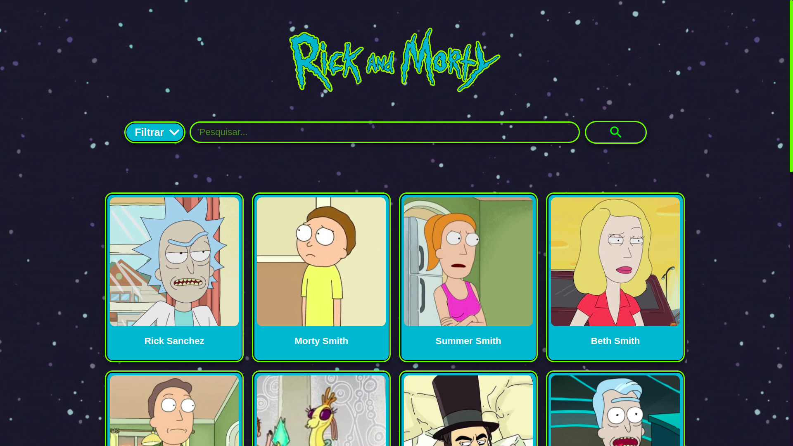
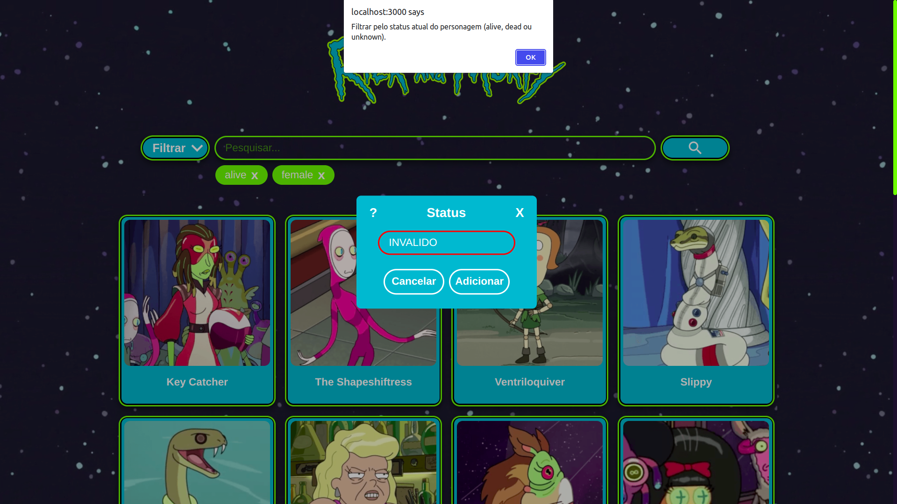
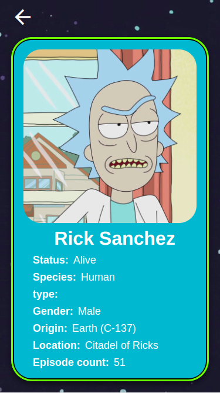

# Green-Acesso-RM
Desafio técnico de frontend da Green Acesso

## Sobre
Esse projeto tem como objetivo listar todos os personagens da série Rick and Morty, mostrando todas as suas informações de maneira simples e atrativa.

O site é completamente responsivo e pode ser acessado a partir de qualquer plataforma.
## Screenshots



*Figura 1: Tela inicial do site*



*Figura 2: Aplicação de filtros e validação de inputs*



*Figura 3: Tela de personagem específico no formato mobile*

### Clonando o repositório

Para clonar o repositório digite:

```console
git clone https://github.com/Thiagof99/Green-Acesso-RM.git
```
### Instalando as dependências

Após clonar o repositório baixe as dependências
```console
yarn install
```
ou
```console
npm i
```
### Executando o programa

Para execurtar o programa execute o comando:
```console
yarn start
```
ou
```console
npm start
```
Após realizar esses passos, a plataforma estará rodando na [porta 3000](http://localhost:3000/)

## Uso 

Para usar o site e suas funcionalidades é simples. É possível encontrar qualquer personagem navegando pelas páginas normalmente, mas caso esteja buscando um personagem específico, também é possível pesquisar por seu nome na barra de perquisa.

Além da pesquisa por nome, para facilitar a busca de um personagem, existem vários tipos de filtros, basta selecionar o desejado no dropdown e especificar em uma modal que vai aparecer. Por exemplo, ao clicar no filtro de gênero basta digitar qual gênero deseja filtrar e pronto, todas as entradas passarão por um processo de validação e caso aquele seja um parametro válido para o filtro, ele será adicionado, caso o contrário aconteça, um alerta aparecerá para ajudar com os parâmetros. É possível vizualizar os parametros aceitos antes de cometer um erro ao clicar no botão de ajuda da modal.

Ao encontrar o personagem desejado, basta clicar no seu card que você será redirecionado imediatamente para a página daquele personagem. Caso queira ver outro personagem, basta voltar para a página inicial e realizar o mesmo processo.

